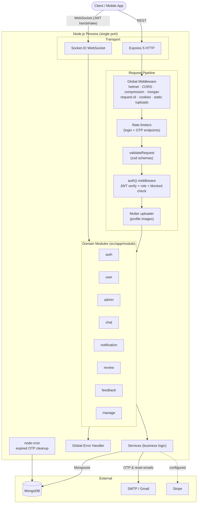
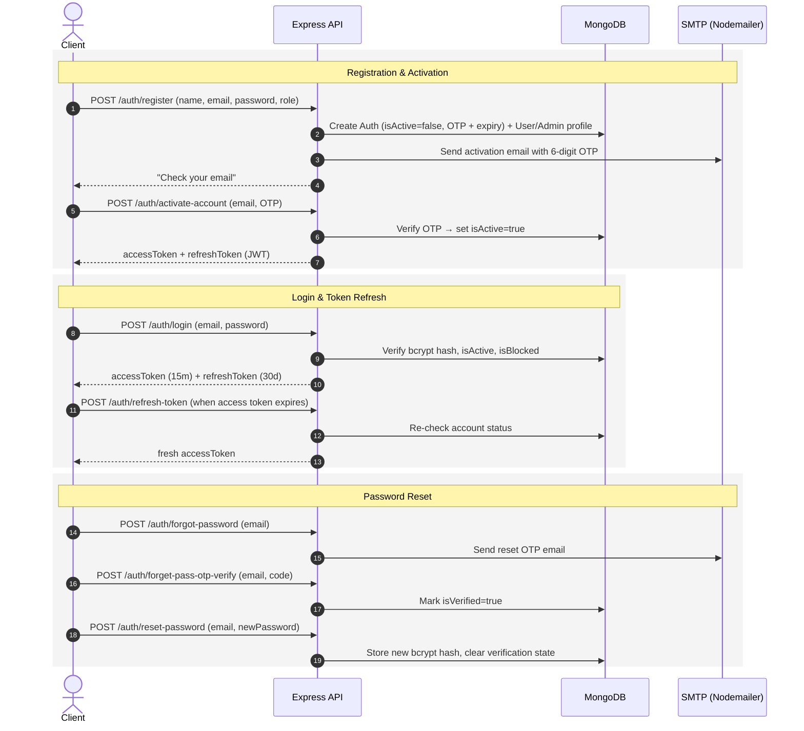
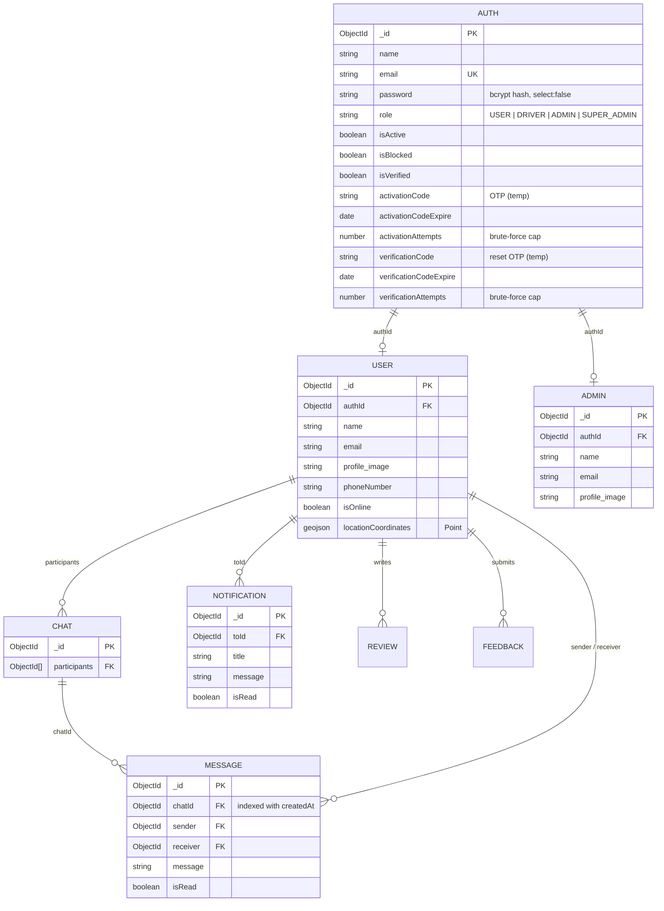

# Server Setup Template — Express + TypeScript + MongoDB

A production-oriented backend starter template built with **Express 5**, **TypeScript**, **Mongoose**, and **Socket.IO**, following a **modular monolith** architecture. It ships with a complete OTP-based authentication system, role-based authorization, real-time chat, file uploads, transactional email, structured logging, and a module generator — so a new project starts at the business-logic layer instead of the plumbing layer.

## Table of Contents

- [Features](#features)
- [Tech Stack](#tech-stack)
- [Architecture](#architecture)
- [Project Structure](#project-structure)
- [Getting Started](#getting-started)
- [Environment Variables](#environment-variables)
- [NPM Scripts](#npm-scripts)
- [Authentication Flow](#authentication-flow)
- [Authorization](#authorization)
- [API Reference](#api-reference)
- [Real-time Communication (Socket.IO)](#real-time-communication-socketio)
- [Data Model](#data-model)
- [Query Builder](#query-builder)
- [Error Handling](#error-handling)
- [File Uploads](#file-uploads)
- [Logging](#logging)
- [Module Generator](#module-generator)
- [Code Quality](#code-quality)
- [Further Documentation](#further-documentation)

## Features

- 🔐 **Full authentication lifecycle** — registration, email OTP activation (expiry + brute-force lockout), login, refresh token endpoint, forgot/reset/change password
- 👥 **Role-based authorization** — `USER`, `DRIVER`, `ADMIN`, `SUPER_ADMIN` levels enforced by a single reusable `auth()` middleware that also re-checks blocked/active status per request; privileged accounts are created via a seeded SUPER_ADMIN, never self-registration
- ✅ **Validation everywhere** — zod schemas for request bodies (`validateRequest`) and for the environment config (fail-fast boot); NoSQL-injection and regex-injection sanitization in the query builder
- 🧱 **Modular monolith** — each domain (`auth`, `user`, `admin`, `chat`, `review`, `feedback`, `notification`, `manage`) is self-contained with its own model, controller, service, and routes
- 💬 **Real-time chat & presence** — Socket.IO with JWT-authenticated handshakes; chat, online status, and live location updates sharing the same HTTP port
- 📧 **Transactional email** — Nodemailer with styled HTML templates for sign-up OTP, OTP resend, and password reset
- 🖼️ **File uploads** — Multer disk storage with MIME-type and field-name whitelisting, 5 MB size limits, random UUID filenames, plus rollback helpers to delete orphaned files on failure
- 🔎 **Chainable query builder** — search, filter, sort, paginate, and field-select any Mongoose query from URL parameters
- ⏰ **Scheduled cleanup** — `node-cron` job prunes expired activation/verification codes every minute
- 🚦 **Rate limiting** — login and every OTP endpoint throttled via `express-rate-limit` (proper HTTP 429s, proxy-aware)
- 🪵 **Structured logging** — Winston with daily-rotated log files, morgan HTTP logs, and per-request `X-Request-Id` correlation
- ⚡ **Module generator** — scaffold a new domain module (model, controller, service, routes) with one command
- 🛡️ **Centralized error handling** — a single global handler normalizes Mongoose, Multer, JWT, Zod, and custom `ApiError` failures into one predictable JSON shape
- 🧪 **Tests & CI** — Vitest + Supertest + in-memory MongoDB suites for the auth flows and query builder; GitHub Actions pipeline (typecheck → lint → format → test → build)
- 🐳 **Containerized** — multi-stage `Dockerfile` and `docker-compose.yml` with MongoDB and health checks
- 📖 **API docs** — Swagger UI served at `/docs` (non-production) from `docs/openapi.yaml`; `/health` endpoint for load balancers

## Tech Stack

| Layer          | Technology                                                         |
| -------------- | ------------------------------------------------------------------ |
| Runtime        | Node.js                                                            |
| Language       | TypeScript (strict tooling: ESLint + typescript-eslint + Prettier) |
| Framework      | Express 5                                                          |
| Database       | MongoDB with Mongoose ODM                                          |
| Real-time      | Socket.IO 4                                                        |
| Auth           | JSON Web Tokens (`jsonwebtoken`) + `bcrypt` password hashing       |
| Email          | Nodemailer (SMTP)                                                  |
| Validation     | Zod (env config + request bodies)                                  |
| Uploads        | Multer (disk storage)                                              |
| Scheduling     | node-cron                                                          |
| Security       | helmet, express-rate-limit, CORS allow-list                        |
| Payments       | Stripe SDK (pre-wired configuration)                               |
| Logging        | Winston + winston-daily-rotate-file, morgan                        |
| Testing        | Vitest, Supertest, mongodb-memory-server                           |
| Dev experience | tsx (hot reload), rimraf, GitHub Actions CI, Docker                |

## Architecture

The application is a **modular monolith**: one deployable unit, internally split by business domain. Every request flows through the same layered pipeline, and every module follows the same `routes → controller → service → model` convention.



Key structural decisions:

- **Split credential and profile data.** The `Auth` collection is the single authority for credentials, roles, OTP codes, and account status. Domain profiles (`User`, `Admin`) link to it via `authId`, so profile schemas never pollute the security model.
- **HTTP and WebSocket share one server.** `src/connection/socket.ts` wraps the Express app in an `http.Server` and attaches Socket.IO to it, so REST and real-time traffic run on the same port.
- **Services own the logic; controllers stay thin.** Controllers only extract request data and shape responses via `sendResponse`; every business rule lives in a service and throws `ApiError` on failure.

## Project Structure

```
├── src/
│   ├── app/
│   │   ├── middleware/           # auth (JWT + roles), fileUploader (Multer),
│   │   │                         # globalErrorHandler, limiter (rate limit)
│   │   ├── module/               # Domain modules — each contains:
│   │   │   │                     #   <Name>.ts            Mongoose model
│   │   │   │                     #   <name>.controller.ts HTTP layer
│   │   │   │                     #   <name>.service.ts    business logic
│   │   │   │                     #   <name>.routes.ts     Express router
│   │   │   ├── admin/            # Admin profile management
│   │   │   ├── auth/             # Registration, OTP activation, login, passwords
│   │   │   ├── chat/             # 1-to-1 chat (Chat + Message models)
│   │   │   ├── feedback/         # User feedback with admin replies
│   │   │   ├── manage/           # CMS content: T&C, privacy, about, FAQ, contact
│   │   │   ├── notification/     # In-app notifications (user + admin)
│   │   │   ├── review/           # User reviews (CRUD)
│   │   │   └── user/             # User profile management
│   │   └── routes/index.ts       # Central router mounting every module
│   ├── builder/queryBuilder.ts   # Chainable search/filter/sort/paginate helper (injection-safe)
│   ├── config/index.ts           # zod-validated .env config (fails fast at startup)
│   ├── connection/               # connectDB (Mongoose), socket (HTTP+WS server), socketCors
│   ├── error/                    # ApiError + Mongoose/Multer/Zod error transformers + 404 handler
│   ├── jobs/                     # Cron bootstrap (startJobs/stopJobs, OTP cleanup)
│   ├── mail/                     # HTML email templates (sign-up, OTP resend, reset password)
│   ├── scripts/                  # seedSuperAdmin.ts (npm run seed:admin)
│   ├── socket/                   # socketAuth (JWT handshake), event handlers, emit helpers
│   ├── types/                    # Shared types + Express Request augmentation
│   ├── util/                     # jwtHelpers, logger, sendEmail, catchAsync,
│   │                             # codeGenerator, generateModule, sendResponse, ...
│   ├── app.ts                    # Express app assembly (middleware + routes)
│   └── server.ts                 # Entry point: DB connect, listen, jobs, graceful shutdown
├── tests/                        # Vitest suites (auth flows, QueryBuilder) + helpers
├── docs/                         # Extended technical documentation + openapi.yaml
├── .github/workflows/ci.yml     # CI: typecheck → lint → format → test → build
├── Dockerfile / docker-compose.yml
├── .env.example                  # Template for required environment variables
├── eslint.config.mjs             # Flat ESLint config (TS + Prettier)
└── tsconfig.json
```

## Getting Started

### Prerequisites

- **Node.js** ≥ 20
- **MongoDB** — a local instance or a MongoDB Atlas cluster (or use Docker, below)
- An **SMTP account** (e.g., Gmail app password) for OTP emails

### Installation

```bash
# 1. Clone and install
git clone <repository-url>
cd server-setup-template-updated
npm install

# 2. Configure environment
cp .env.example .env
# then edit .env with your MongoDB URI, JWT secrets, and SMTP credentials
# (startup fails fast with a clear message if anything required is missing)

# 3. Seed the first SUPER_ADMIN (uses SUPER_ADMIN_EMAIL/PASSWORD from .env)
npm run seed:admin

# 4. Run in development (hot reload)
npm run dev
```

The API is now available at `http://<BASE_URL>:<PORT>` (default `http://0.0.0.0:8001`). `GET /health` reports DB connectivity and uptime; interactive API docs are at `/docs` (non-production).

### Docker

```bash
docker compose up   # API + MongoDB with health checks
```

### Production build

```bash
npm run build     # cleans dist/ and compiles TypeScript
npm start         # runs the compiled dist/server.js
```

## Environment Variables

All variables are validated once at startup by the zod schema in `src/config/index.ts` — the app exits with a per-field error report if anything required is missing or malformed.

| Variable                                     | Description                                 | Example                                   |
| -------------------------------------------- | ------------------------------------------- | ----------------------------------------- |
| `NODE_ENV`                                   | Runtime environment                         | `development`                             |
| `BASE_URL`                                   | Host interface to bind                      | `0.0.0.0`                                 |
| `PORT`                                       | HTTP + WebSocket port                       | `8001`                                    |
| `MONGO_URL`                                  | MongoDB connection string                   | `mongodb://localhost:27017/appDB`         |
| `BCRYPT_SALT_ROUNDS`                         | bcrypt cost factor                          | `12`                                      |
| `JWT_SECRET`                                 | Access-token signing secret (min 32 chars)  | _(long random string)_                    |
| `JWT_EXPIRES_IN`                             | Access-token lifetime                       | `15m`                                     |
| `JWT_REFRESH_SECRET`                         | Refresh-token signing secret (min 32 chars) | _(long random string)_                    |
| `JWT_REFRESH_EXPIRES_IN`                     | Refresh-token lifetime                      | `30d`                                     |
| `SUPER_ADMIN_EMAIL` / `SUPER_ADMIN_PASSWORD` | Credentials for `npm run seed:admin`        | `admin@example.com` / _(strong password)_ |
| `SMTP_HOST` / `SMTP_PORT` / `SMTP_SERVICE`   | SMTP transport settings                     | `smtp.gmail.com` / `587` / `gmail`        |
| `SMTP_MAIL` / `SMTP_PASSWORD`                | Sender credentials                          | `example@gmail.com` / _(app password)_    |
| `SERVICE_NAME`                               | Product name used in emails                 | `Mount Fuji`                              |
| `STRIPE_SECRET_KEY`                          | Stripe API secret (optional)                | `sk_test_...`                             |
| `EMAIL_TEMP_IMAGE`                           | Logo URL used in email templates            | _(image URL)_                             |

## NPM Scripts

| Script                                    | Purpose                                                                  |
| ----------------------------------------- | ------------------------------------------------------------------------ |
| `npm run dev`                             | Development server with hot reload (`tsx watch`)                         |
| `npm run build`                           | Clean `dist/` and compile TypeScript                                     |
| `npm start`                               | Run compiled production build                                            |
| `npm test` / `npm run test:watch`         | Run the Vitest suites (spins up an in-memory MongoDB)                    |
| `npm run typecheck`                       | Type-check without emitting                                              |
| `npm run lint:check` / `lint:fix`         | ESLint check / auto-fix                                                  |
| `npm run prettier:check` / `prettier:fix` | Formatting check / auto-format                                           |
| `npm run seed:admin`                      | Idempotently create the SUPER_ADMIN account                              |
| `npm run make:file -- <Name>`             | Scaffold a new domain module (see [Module Generator](#module-generator)) |

## Authentication Flow

Credentials live in the `Auth` collection; profile data lives in `User`/`Admin` linked by `authId`. New accounts stay inactive until the emailed 6-digit OTP (3-minute expiry, invalidated after 5 wrong attempts) is confirmed. Only `USER` accounts can self-register — admins are created by a seeded SUPER_ADMIN via `POST /admin/create-admin`. A cron job clears expired codes every minute as cleanup; expiry is enforced in the services themselves.



JWT payloads carry `{ authId, userId, email, role }`, so downstream handlers can resolve both the credential record and the domain profile without extra lookups.

## Authorization

The `auth(roles)` middleware (`src/app/middleware/auth.ts`) verifies the `Bearer` token, confirms the account still exists **and is active and not blocked** (so blocking a user takes effect immediately, not at next login), attaches the decoded payload to `req.user`, and enforces role membership. Access levels are defined centrally in `src/config/index.ts`:

| Level                    | Roles allowed                  |
| ------------------------ | ------------------------------ |
| `auth_level.user`        | `USER`, `ADMIN`, `SUPER_ADMIN` |
| `auth_level.admin`       | `ADMIN`, `SUPER_ADMIN`         |
| `auth_level.super_admin` | `SUPER_ADMIN`                  |

Passing `isAccessible = false` makes authentication optional for an endpoint (used by public feedback submission).

## API Reference

All routes are mounted at the root path by `src/app/routes/index.ts`. 🔒 = requires `Bearer` token.

### Auth — `/auth`

All public auth endpoints are rate-limited (login 10/h; OTP send 3/15min; OTP verify 5/15min) and validated with zod schemas.

| Method | Endpoint                  | Access  | Description                                                   |
| ------ | ------------------------- | ------- | ------------------------------------------------------------- |
| POST   | `/register`               | Public  | Create a USER account; sends activation OTP email             |
| POST   | `/login`                  | Public  | Login; returns access + refresh tokens                        |
| POST   | `/refresh-token`          | Public  | Exchange a refresh token (body or cookie) for an access token |
| POST   | `/activate-account`       | Public  | Verify OTP (expiry + attempt cap); returns JWT pair           |
| POST   | `/activation-code-resend` | Public  | Re-issue activation OTP                                       |
| POST   | `/forgot-password`        | Public  | Send password-reset OTP                                       |
| POST   | `/forget-pass-otp-verify` | Public  | Verify reset OTP                                              |
| POST   | `/reset-password`         | Public  | Set new password after OTP verification                       |
| PATCH  | `/change-password`        | 🔒 user | Change password with old-password check                       |

### User — `/user` &nbsp;·&nbsp; Admin — `/admin`

| Method | Endpoint          | Access          | Description                                          |
| ------ | ----------------- | --------------- | ---------------------------------------------------- |
| POST   | `/create-admin`   | 🔒 super admin  | Create a pre-activated ADMIN account (`/admin` only) |
| GET    | `/profile`        | 🔒 user / admin | Get own profile (populated with auth data)           |
| PATCH  | `/edit-profile`   | 🔒 user / admin | Update profile; supports `profile_image` upload      |
| DELETE | `/delete-account` | 🔒 user / admin | Delete own account                                   |

### Chat — `/chat`

| Method | Endpoint                  | Access  | Description                                      |
| ------ | ------------------------- | ------- | ------------------------------------------------ |
| POST   | `/post-chat`              | 🔒 user | Start (or fetch) a chat with another participant |
| GET    | `/get-chat-messages`      | 🔒 user | Paginated messages of a chat                     |
| GET    | `/get-all-chats`          | 🔒 user | All chats of the current user                    |
| PATCH  | `/update-message-as-seen` | 🔒 user | Mark messages as read                            |

### Notification — `/notification`

| Method | Endpoint                 | Access  | Description                        |
| ------ | ------------------------ | ------- | ---------------------------------- |
| GET    | `/get-notification`      | 🔒 user | Get a single notification          |
| GET    | `/get-all-notifications` | 🔒 user | List own notifications (paginated) |
| PATCH  | `/update-as-mark-unread` | 🔒 user | Toggle read/unread                 |
| DELETE | `/delete-notification`   | 🔒 user | Delete a notification              |

### Review — `/review`

| Method | Endpoint           | Access  | Description                         |
| ------ | ------------------ | ------- | ----------------------------------- |
| POST   | `/post-review`     | 🔒 user | Create review                       |
| GET    | `/get-review`      | 🔒 user | Get single review                   |
| GET    | `/get-all-reviews` | 🔒 user | List reviews (search/sort/paginate) |
| PATCH  | `/update-review`   | 🔒 user | Update own review                   |
| DELETE | `/delete-review`   | 🔒 user | Delete review                       |

### Feedback — `/feedback`

| Method | Endpoint                      | Access                 | Description         |
| ------ | ----------------------------- | ---------------------- | ------------------- |
| POST   | `/post-feedback`              | Public (optional auth) | Submit feedback     |
| GET    | `/get-feedback`               | 🔒 user                | Get single feedback |
| GET    | `/get-all-feedbacks`          | 🔒 user                | List feedback       |
| PATCH  | `/update-feedback-with-reply` | 🔒 admin               | Reply to feedback   |
| DELETE | `/delete-feedback`            | 🔒 user                | Delete feedback     |

### Manage (CMS) — `/manage`

Admin-editable static content, publicly readable. Each content type — **terms-conditions**, **privacy-policy**, **about-us**, **faq**, **contact-us** — follows the same pattern:

| Method | Endpoint pattern    | Access   |
| ------ | ------------------- | -------- |
| POST   | `/add-<content>`    | 🔒 admin |
| GET    | `/get-<content>`    | Public   |
| DELETE | `/delete-<content>` | 🔒 admin |

## Real-time Communication (Socket.IO)

Socket.IO is attached to the same HTTP server (`src/connection/socket.ts`). Handshakes are **JWT-authenticated** by an `io.use()` middleware (`src/socket/socketAuth.ts`): the client connects with `{ auth: { token } }` and the user identity is derived from the verified token — never from client-supplied ids. The server joins the socket to a room named after the user id (enabling direct emits) and marks them online.

```js
// Client connection
const socket = io("http://localhost:8001", {
  auth: { token: accessToken },
});
```

| Event                       | Direction       | Payload                           | Description                                                      |
| --------------------------- | --------------- | --------------------------------- | ---------------------------------------------------------------- |
| `connection` / `disconnect` | —               | `{ auth: { token } }` handshake   | Presence tracked automatically (`isOnline` on the User document) |
| `online_status`             | server → client | `{ isOnline }`                    | Confirmation of presence change                                  |
| `update_location`           | bidirectional   | `{ lat, long }`                   | Persists GeoJSON coordinates and broadcasts them                 |
| `send_message`              | client → server | `{ chatId, receiverId, message }` | Persists the message and emits it to the receiver's room         |
| `socket_error`              | server → client | error envelope                    | Emitted by `socketCatchAsync` on any handler failure             |

Socket handlers mirror the HTTP conventions: `socketCatchAsync` wraps every handler, `emitResult`/`emitError` produce the same response envelope the REST API uses.

## Data Model



Separating `Auth` from profile collections keeps credential logic in one place: any account-status rule (blocking, activation, OTP) is enforced against `Auth`, while feature modules only ever touch profile documents. Messages live in their own collection keyed by `chatId` (compound-indexed with `createdAt`), so chat documents stay bounded regardless of conversation length; `User.locationCoordinates` carries a 2dsphere index for geo queries.

## Query Builder

`src/builder/queryBuilder.ts` turns URL query strings into composed Mongoose queries:

```
GET /review/get-all-reviews?searchTerm=great&sort=-createdAt&page=2&limit=10&fields=rating,comment
```

```ts
const reviewQuery = new QueryBuilder(Review.find(), req.query)
  .search(["comment"]) // case-insensitive $regex across given fields
  .filter() // remaining query params become exact-match filters
  .sort() // comma-separated sort keys, defaults to -createdAt
  .paginate() // page/limit with sane defaults
  .fields(); // field projection

const [meta, reviews] = await Promise.all([
  reviewQuery.countTotal(), // { page, limit, total, totalPage }
  reviewQuery.modelQuery,
]);
```

Both `search()` and `filter()` are injection-safe: search terms have regex metacharacters escaped (no ReDoS / regex injection), and `filter()` drops non-string values and `$`/dotted keys, so `?age[$ne]=0`-style NoSQL operator injection is neutralized (the app additionally uses Express's `simple` query parser).

## Error Handling

Request bodies are validated before controllers run via the `validateRequest(zodSchema)` middleware (see `auth.validation.ts` for the pattern). All failures funnel into `globalErrorHandler`, which recognizes Mongoose `ValidationError`/`CastError`, duplicate-key errors, Multer errors, Zod errors, and the project's `ApiError` class, then responds with a stable contract:

```json
{
  "success": false,
  "message": "Human-readable reason",
  "errorMessages": [
    { "path": "email", "message": "Please provide a valid email address" }
  ],
  "stack": "shown outside production only"
}
```

Successful responses are equally uniform via `sendResponse`:

```json
{
  "statusCode": 200,
  "success": true,
  "message": "Reviews retrieved",
  "meta": { "page": 1, "limit": 10, "total": 42, "totalPage": 5 },
  "data": []
}
```

Controllers never use try/catch — the `catchAsync` wrapper forwards rejected promises to the error pipeline (with `socketCatchAsync` as the WebSocket counterpart).

## File Uploads

`uploadFile()` (`src/app/middleware/fileUploader.ts`) configures Multer disk storage under `uploads/<fieldname>/`:

- Whitelisted MIME types: `image/jpeg`, `image/png`, `image/jpg`, `image/webp`
- Whitelisted field names (currently `profile_image`) — unknown fields are rejected
- 5 MB per-file size limit; filenames are random UUIDs with extensions derived from the validated MIME type (never from user input)
- Every stored path is tracked on `req.uploadedFiles`, so `deleteUploadedFiles` can roll back writes if the request later fails
- Uploaded files are served statically at `/uploads/...` with cache headers

## Logging

Winston is configured in `src/util/logger.ts` with two streams:

- `logger` — application/info logs (also receives morgan HTTP access logs)
- `errorLogger` — failures (also captures `unhandledRejection` / `uncaughtException`)

Both write to console and to **daily-rotated files** under `logs/`, keeping production logs bounded and greppable by date. Every request gets a `X-Request-Id` header (also included in the HTTP log line) for correlating a client report with server logs.

## Module Generator

To add a new domain, scaffold the standard four files with:

```bash
npm run make:file -- Booking
```

This generates `Booking.ts` (model), `booking.controller.ts`, `booking.service.ts`, and `booking.routes.ts` under `src/app/module/booking/` from the templates in `src/util/fileTemplates.ts`, pre-wired with `catchAsync`, `sendResponse`, `QueryBuilder` usage, and the project's naming conventions. After generating, mount the new router in `src/app/routes/index.ts`.

## Code Quality

- **TypeScript** across the entire codebase (fully migrated from JavaScript)
- **ESLint flat config** with `typescript-eslint` recommended rules
- **Prettier** enforced via `prettier:check`, with `lint-staged` configured for pre-commit fixing
- **Vitest + Supertest + mongodb-memory-server** — the full auth lifecycle (register → activate → login → refresh → change password), OTP brute-force lockout, and QueryBuilder injection-safety are covered by tests that run against a real in-memory MongoDB
- **GitHub Actions CI** (`.github/workflows/ci.yml`) — typecheck → lint → format check → tests → build on every push/PR, across Node 20 and 22

## Further Documentation

Extended documentation lives in [`docs/`](./docs):

| Document                                                                                                    | Contents                                                        |
| ----------------------------------------------------------------------------------------------------------- | --------------------------------------------------------------- |
| [`api/`](./docs/api/README.md)                                                                              | **Full API reference** — per-module endpoint docs with examples |
| [`api/postman_collection.json`](./docs/api/postman_collection.json)                                         | Postman collection with auto token capture — import and go      |
| [`project_technical_documentation.md`](./docs/project_technical_documentation.md)                           | Deep technical overview for developers/AI assistants            |
| [`migration_guide.md`](./docs/migration_guide.md) / [`migration_analysis.md`](./docs/migration_analysis.md) | JavaScript → TypeScript migration notes                         |
| [`issues_and_improvements.md`](./docs/issues_and_improvements.md)                                           | Known issues, security review findings, and improvement roadmap |
| [`implementation_plan.md`](./docs/implementation_plan.md)                                                   | Phased, step-by-step plan for executing the improvement roadmap |
| [`openapi.yaml`](./docs/openapi.yaml)                                                                       | OpenAPI 3 spec, served as Swagger UI at `/docs`                 |
| [`template_review_and_improvements.md`](./docs/template_review_and_improvements.md)                         | Earlier template review                                         |

---

**Author:** thakur-saad · **License:** ISC
