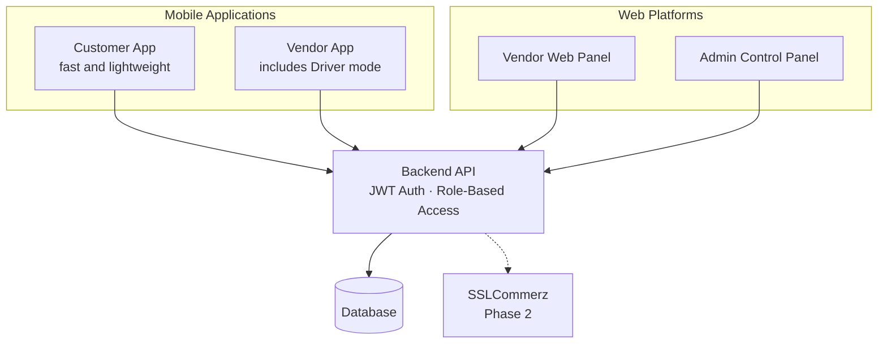
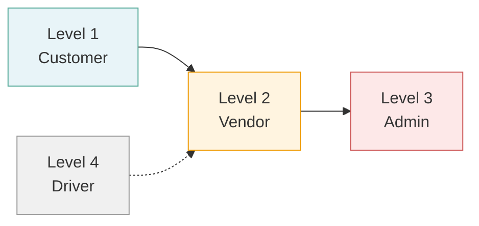
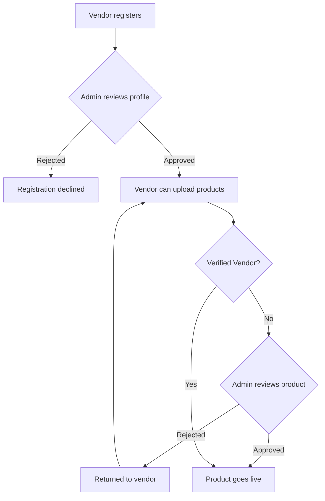
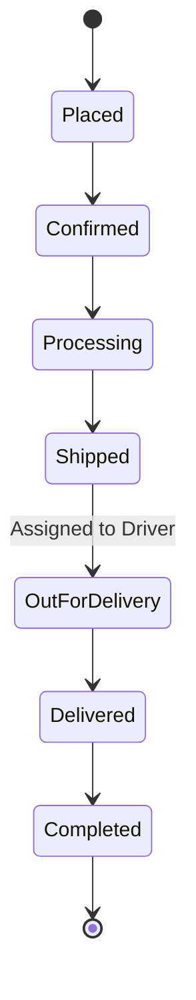
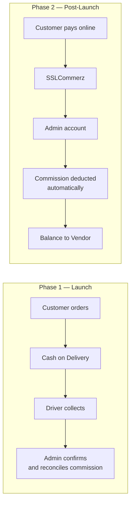
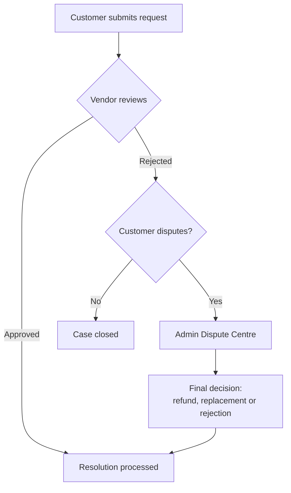
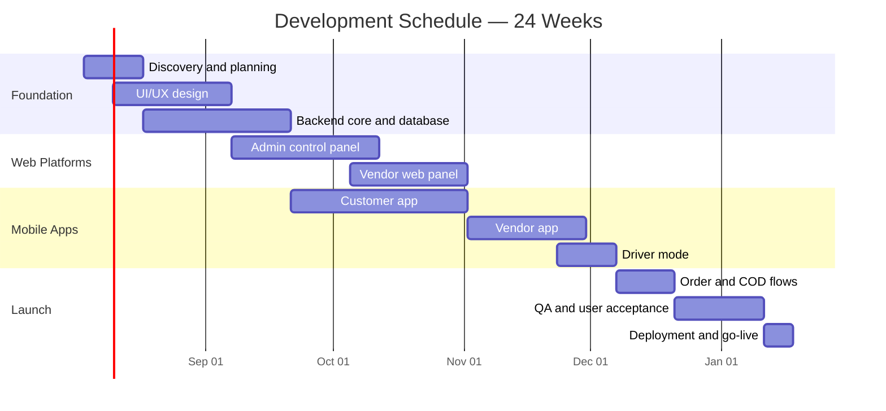

# Multi-Vendor E-Commerce Platform

### Product & Technical Specification

A multi-vendor marketplace where independent sellers list products, customers buy them, drivers deliver them, and an administrator oversees the entire operation from a single control panel.

**Delivery scope:** 2 mobile applications · 2 web platforms · 1 shared backend

---

## 1. System Overview

### Why this architecture

| Decision                     | Reasoning                                                                                  |
| ---------------------------- | ------------------------------------------------------------------------------------------ |
| Separate Customer app        | Keeps the shopping experience fast and lightweight — no seller tooling weighing it down    |
| Driver inside the Vendor app | Delivery staff get a simple, focused mode instead of a fifth product to build and maintain |
| Vendor on both app and web   | Sellers manage on the go, but do bulk work comfortably on a larger screen                  |
| Admin on web only            | The admin dashboard carries the heaviest workflows and needs the screen real estate        |

---

## 2. Access Levels

Every request is authenticated with JWT and authorised against the user's role. No endpoint is reachable outside its permitted level.

---

## 3. Role Specifications

### 3.1 Customer — Level 1

**Platform:** Customer mobile app

| #   | Capability                                                         |
| --- | ------------------------------------------------------------------ |
| 1   | Browse all products and categories                                 |
| 2   | Search and filter by price, recency, availability, brand, category |
| 3   | View detailed product pages                                        |
| 4   | Add to cart, update quantities, remove items                       |
| 5   | Secure checkout flow                                               |
| 6   | Place orders                                                       |
| 7   | Bookmark / wishlist products _(logged-in only)_                    |
| 8   | Manage own profile                                                 |
| 9   | Manage multiple shipping addresses                                 |
| 10  | Live chat with Admin or Vendor                                     |

### 3.2 Vendor / Seller — Level 2

**Platform:** Vendor mobile app + Vendor web panel

| #   | Capability                                                                                |
| --- | ----------------------------------------------------------------------------------------- |
| 1   | Register on the platform                                                                  |
| 2   | Profile manually reviewed and approved by Admin                                           |
| 3   | Upload products only after account approval                                               |
| 4   | Uploaded products require Admin approval before going live                                |
| 5   | **Verified Vendor exception** — trusted vendors publish directly, no per-product approval |
| 6   | Edit own products and update stock status                                                 |
| 7   | Earn commission from sales                                                                |
| 8   | View own sales and transactions                                                           |
| 9   | Bookmark products _(logged-in only)_                                                      |
| 10  | Live chat with Customers and Admin                                                        |
| 11  | Update order and delivery status                                                          |
| 12  | Profile updates require Admin re-approval                                                 |

### 3.3 Admin — Level 3

**Platform:** Admin web control panel

| #   | Capability                                                                                     |
| --- | ---------------------------------------------------------------------------------------------- |
| 1   | Full access to all system features                                                             |
| 2   | Approve or reject vendor registrations                                                         |
| 3   | Approve or reject vendor product listings                                                      |
| 4   | Approve or reject vendor profile updates                                                       |
| 5   | Grant Verified Vendor status after manual review                                               |
| 6   | Manage all users, vendors and products                                                         |
| 7   | View user and vendor information                                                               |
| 8   | Block users or vendors for suspicious activity                                                 |
| 9   | Configure platform settings and commission rates                                               |
| 10  | Oversee all transactions and payments                                                          |
| 11  | Add or remove promotional banners                                                              |
| 12  | Generate coupon codes                                                                          |
| 13  | Add, update and delete categories                                                              |
| 14  | Assign products to categories and brands                                                       |
| 15  | Add products directly from the dashboard                                                       |
| 16  | Centralised dashboard covering approvals, catalogue, users, transactions, stock and commission |

### 3.4 Driver — Level 4 _(Minimal by design)_

**Platform:** Driver mode inside the Vendor mobile app

| #   | Capability                                                  |
| --- | ----------------------------------------------------------- |
| 1   | Log in with driver credentials                              |
| 2   | View orders assigned for delivery                           |
| 3   | View customer name, address and contact for assigned orders |
| 4   | Update delivery status                                      |
| 5   | Mark Cash on Delivery payment as collected                  |

> Deliberately limited to the five actions required for the delivery loop to function. No analytics, no earnings module, no routing — those add cost without adding capability at launch.

### 3.5 Shared System Features

| #   | Capability                                      |
| --- | ----------------------------------------------- |
| 1   | JWT authentication and tokenisation             |
| 2   | Role-based authorisation across all four levels |
| 3   | Hashed passwords, no plain-text storage         |
| 4   | Encrypted API communication                     |
| 5   | Secure session handling                         |
| 6   | Referral system                                 |
| 7   | Promotional coupon system                       |
| 8   | Google Analytics integration                    |
| 9   | Loyalty / credit-coin system                    |

---

## 4. Vendor Onboarding & Product Approval

The Verified Vendor tier removes the approval bottleneck for proven sellers while keeping new sellers gated — quality control that scales.

---

## 5. Order Lifecycle

Status is updated by the Vendor, the Driver, or the Admin depending on the stage. Orders containing items from multiple vendors are split into separate shipments, each tracked independently.

---

## 6. Payments

Payments are handled as a phased rollout rather than a single launch feature.

**Phase 1 — Cash on Delivery only.** Every order launches as COD to build customer trust before any online payment is introduced. Vendor and Driver update delivery status; Admin confirms collection and reconciles commission manually.

**Phase 2 — SSLCommerz added.** One gateway, no others planned. Customer pays through the platform, funds reach the Admin account, commission is deducted automatically and the balance is allocated to the vendor. COD remains available alongside it.

---

## 7. Cancellation, Return & Refund

This spans all four roles, so it is specified separately. Two options are on the table.

**Option A — Full flow with Dispute Centre**

**Option B — Simple manual handling** _(recommended for launch)_

- Customer contacts Admin or Vendor through live chat — no dedicated request form or escalation workflow
- Admin reviews each case manually and decides the outcome
- Refunds are recorded and processed manually
- Significantly cheaper to build, and upgradeable to Option A once order volume justifies it

---

## 8. Enhancement Roadmap

Beyond the core specification, the following are recommended additions — sequenced so the marketplace launches lean and grows on real usage data.

**Customer**
Product ratings and reviews · real-time order tracking with delivery timeline · order history and one-click reorder · coupon and loyalty-point redemption at checkout · product Q&A · order notifications · guest checkout · cart saved across devices · social login

**Vendor**
Branded storefront page · sales analytics dashboard · public replies to reviews · downloadable payout and commission statements · vendor rating based on delivery time, quality and responsiveness

**Admin**
Site-wide analytics — GMV, active users, conversion rate, top categories · review and Q&A moderation · admin action audit log · CMS for static pages · scheduled product publishing · product status history

**AI-Powered**
Typeahead search suggestions · recommendation engine for personalised product discovery · automated FAQ chatbot that escalates to live chat when needed

**Platform-Wide**
Order lifecycle tracking · split shipments for multi-vendor orders · push and email notifications · in-app notification centre · flash sales with countdown timers · first-order discount · email newsletters · two-factor authentication for Admin and Vendor · rate limiting and brute-force protection · input sanitisation against SQL injection and XSS · PDF invoice generation · exportable accounting reports · responsive and accessible UI

---

## 9. Project Timeline

| Stage                | Duration | Deliverable                                                 |
| -------------------- | -------- | ----------------------------------------------------------- |
| Discovery & planning | 2 weeks  | Finalised requirements, data model, API contract            |
| UI/UX design         | 4 weeks  | Wireframes and high-fidelity screens for all four platforms |
| Backend core         | 5 weeks  | Auth, roles, catalogue, cart, order APIs                    |
| Admin panel          | 5 weeks  | Full control panel with approval workflows                  |
| Vendor web panel     | 4 weeks  | Product and order management on web                         |
| Customer app         | 6 weeks  | Browse, search, cart, checkout, profile                     |
| Vendor app           | 4 weeks  | Mobile product and order management                         |
| Driver mode          | 2 weeks  | Assigned deliveries and status updates                      |
| Order & COD flows    | 2 weeks  | End-to-end order and payment reconciliation                 |
| QA & UAT             | 3 weeks  | Testing, bug fixes, client sign-off                         |
| Deployment           | 1 week   | Production launch, store submissions                        |

**Total: approximately 24 weeks (6 months) to production launch.**

Stages overlap where dependencies allow, which is what keeps a four-platform build inside six months rather than stretching past nine.

### Post-launch phases

| Phase   | Focus                                                                                         | Estimated  |
| ------- | --------------------------------------------------------------------------------------------- | ---------- |
| Phase 2 | SSLCommerz integration, reviews and ratings, notifications, order tracking, coupons, wishlist | 6–8 weeks  |
| Phase 3 | Loyalty points, referral programme, vendor analytics, flash sales                             | 6–8 weeks  |
| Phase 4 | AI recommendations, advanced analytics, chatbot, dispute centre                               | 8–10 weeks |

---

## 10. Security

| Layer          | Measure                                                              |
| -------------- | -------------------------------------------------------------------- |
| Authentication | JWT with tokenisation                                                |
| Authorisation  | Strict role-based access control across all four levels              |
| Passwords      | Hashed, never stored in plain text                                   |
| Transport      | Encrypted API communication over HTTPS                               |
| Sessions       | Secure session handling                                              |
| Input          | Sanitisation against SQL injection and XSS                           |
| Access control | Brute-force protection and rate limiting on authentication endpoints |
| Transactions   | Tamper-protected payment flow with full audit trail                  |

---

## Assumptions

- Timeline assumes a dedicated team working in parallel across backend, web and mobile
- Client feedback is provided within agreed review windows at each stage gate
- Third-party accounts — SSLCommerz merchant, app store developer accounts, hosting — are provisioned by the client
- Scope is as specified above; additions are handled as change requests

---

_Prepared for client review. Commercial terms to follow separately._
